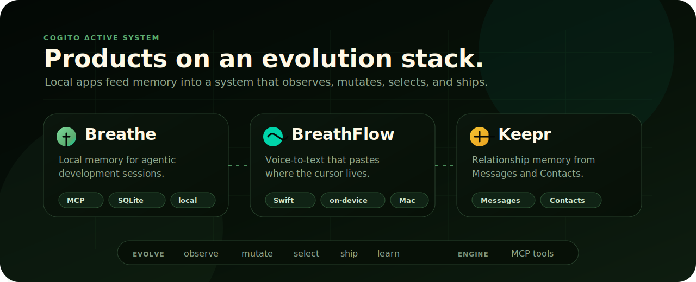

  

  <a href="https://cogito.cv"><b>cogito.cv</b></a>
  &nbsp;&nbsp;·&nbsp;&nbsp;
  <a href="https://cogito.cv/breathe">Breathe</a>
  &nbsp;&nbsp;·&nbsp;&nbsp;
  <a href="https://cogito.cv/breathflow">BreathFlow</a>
  &nbsp;&nbsp;·&nbsp;&nbsp;
  <a href="https://cogito.cv/keepr">Keepr</a>
  &nbsp;&nbsp;·&nbsp;&nbsp;
  <a href="mailto:foundry@cogito.cv">foundry@cogito.cv</a>

<h1 align="center">Cogito</h1>

  <b>We build software that rewrites itself.</b>

  The codebase is a genome. Evolution cycles observe fitness, generate mutations,
  select survivors, and ship improvements autonomously, continuously.

  Software rots. We fight entropy at the source.

  <code>macOS</code>
  <code>Swift</code>
  <code>SwiftUI</code>
  <code>TypeScript</code>
  <code>Node</code>
  <code>SQLite</code>
  <code>Claude Code</code>

  

---

## Products

Three macOS apps. All local. No accounts.

| Product | What it does |
|---|---|
| [**Breathe**](https://cogito.cv/breathe) | Local memory for Claude Code. Auto-captures every session via lifecycle hooks. Surfaces patterns. Restores context across projects. |
| [**BreathFlow**](https://cogito.cv/breathflow) | System-wide voice-to-text. Hold a hotkey, speak, release. Text pasted into any app. On-device WhisperKit, no cloud. |
| [**Keepr**](https://cogito.cv/keepr) | Relationship memory. Scans iMessage and Contacts locally, finds the people you went quiet with, opens the thread when it is time. |

---

## Platform

The products run on an agentic harness called Evolve, a self-improving loop that scans a codebase once, builds a specialized agent team, and improves it through observed outcomes.

| Layer | Role |
|---|---|
| **Kernel** | Capability decomposition, agent routing, arbitration. |
| **Engine** | 40+ MCP tool handlers, 400+ YAML recipes, governance rules. |
| **Breathe** | Local MCP daemon and memory graph at `localhost:4567`. |

The platform learns what each product needs, then builds the intelligence to build it.

---

## Stack

macOS · Swift · SwiftUI · TypeScript · Node · SQLite · Claude Code

---

## Contact

  <a href="https://cogito.cv"><b>cogito.cv</b></a>
  &nbsp;&nbsp;·&nbsp;&nbsp;
  <a href="mailto:foundry@cogito.cv"><b>foundry@cogito.cv</b></a>

